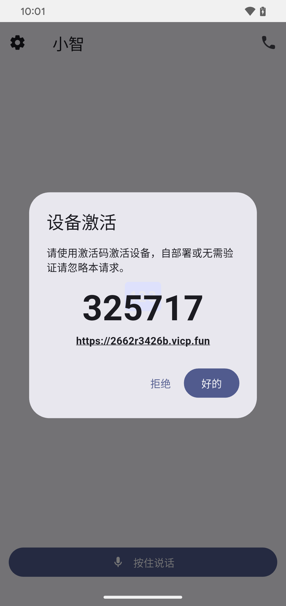
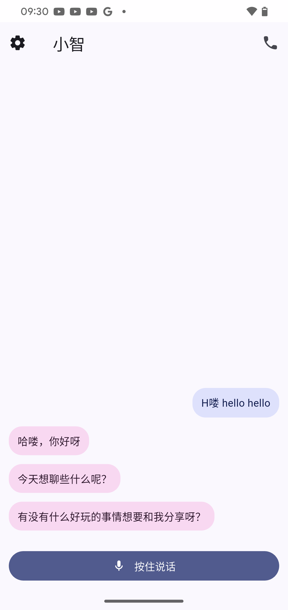
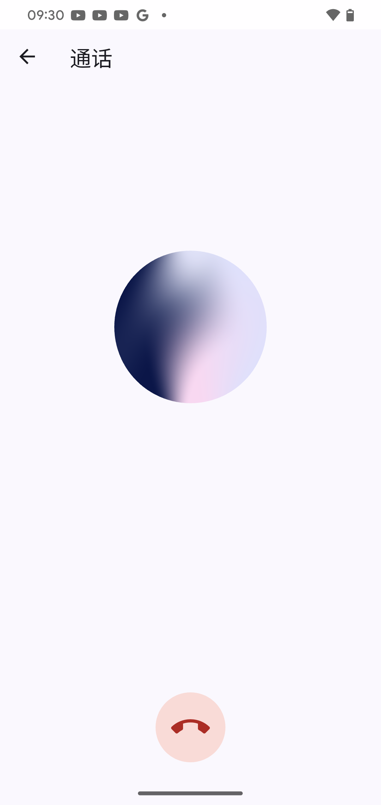
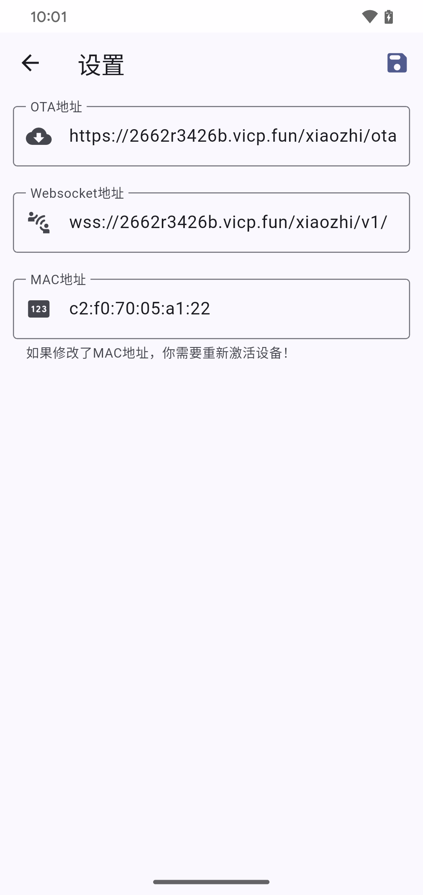

# Xiaozhi/小智 Flutter客户端
***
### 🐣项目简介
Xiaozhi/小智Websocket协议客户端，基于Flutter开发，支持Android和iOS平台
***
### 📱应用截图
|      |  |  |  |
|  ----  |--------------------------------------|--------------------------------------|--------------------------------------|
***
### 📲系统要求
- Android 11+ (API 30)
- iOS 13+
***
### ⚡️运行流程
1. 打开APP复制激活码，在对应后台注册账号激活
2. 配置智能体
3. 开始使用
***
### 🛜免费服务器地址
<ol>
<li>xinnan-tech(默认)</li>
<ol>
<li>管理后台地址：https://2662r3426b.vicp.fun</li>
<li>OTA地址：https://2662r3426b.vicp.fun/xiaozhi/ota/</li>
<li>Websocket地址：wss://2662r3426b.vicp.fun/xiaozhi/v1/</li>
</ol>
<li>xiaozhi.me(⚠️暂未测试)</li>
<ol>
<li>管理后台地址：https://xiaozhi.me</li>
<li>OTA地址：https://api.tenclass.net/xiaozhi/ota/</li>
<li>Websocket地址：wss://api.tenclass.net/xiaozhi/v1/</li>
</ol>
</ol>

***
### ⚙️编译环境
- Flutter 3.29.2
- Dart 3.7.2
***
### 📋功能进度
✅国际化（中文/英文）
 
✅按键对话
 
✅连续通话
 
✅手动激活（自动获取验证码）
 
✅自定义OTA地址、Websocket地址、MAC地址
 
✅历史消息
*** 
### 💾参考项目
[78/xiaozhi-esp32](https://github.com/78/xiaozhi-esp32)
 
[xinnan-tech/xiaozhi-esp32-server](https://github.com/xinnan-tech/xiaozhi-esp32-server)
 
[TOM88812/xiaozhi-android-client](https://github.com/TOM88812/xiaozhi-android-client)
***
#### བཀྲ་ཤིས་བདེ་ལེགས་ 扎西德勒